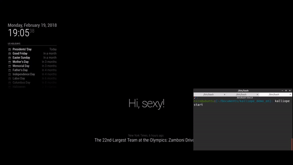

# Magic Mirror

## Synopsis

Neuron to bind Kalliope with your [Magic Mirror](https://magicmirror.builders/).

This neuron allow you to:
- show what Kalliope say on the screen
- control your Magic Mirror by sending notification to other active modules

>**Note:** The [MMM-kalliope](https://github.com/kalliope-project/MMM-kalliope) module need to be installed on your Magic Mirror



[Video demo with sound here](https://youtu.be/QHwctPbJ2ZY)

## Installation
```bash
kalliope install --git-url https://github.com/kalliope-project/kalliope_neuron_magic_mirror.git
```

## Options

| parameter    | required | type   | default | choices | comment                                                                                                                                                   |
|--------------|----------|--------|---------|---------|-----------------------------------------------------------------------------------------------------------------------------------------------------------|
| mm_url       | YES      | string |         |         | URL of your magic mirror. E.g: http://127.0.0.1:8080/kalliope                                                                                             |
| notification | YES      | string |         |         | Notification string that will be recognized by Magic Mirror modules. Use "KALLIOPE" to target the MMM-kalliope module and print the payload on the screen |
| payload      | YES      | dict   |         |         | Dict of parameters to send to the Magic Mirror module                                                                                                     |


## Return Values

| Name            | Description                                                                            | Type   | sample                                                                                          |
|-----------------|----------------------------------------------------------------------------------------|--------|-------------------------------------------------------------------------------------------------|
| status_code     | Numeric, HTTP status code that signifies success of the request.                       | int    | 200                                                                                             |
| content         | The body content of the server answer. May be JSON serialized and usable in a template | string | {"title": "foo", "body": "bar", "userId": 1}                                                    |
| response_header | Response header from the server.                                                       | dict   | {'Date': 'Sat, 19 Nov 2016 11:17:56 GMT', 'Content-Length': '192', 'Content-Type': 'text/html'} |


## Synapses example

Send an hard coded message that will be printed on the screen by the MMM-kalliope module
```yml
  - name: "mm-send-message"
    signals:
      - order: "send a message to my magic mirror"
    neurons:
      - magic_mirror:
          mm_url: "http://127.0.0.1:8080/kalliope"
          notification: "KALLIOPE"
          payload: "this message will be printed on the screen"
```

Send a notification to the [alert module](https://github.com/MichMich/MagicMirror/tree/master/modules/default/alert).
```yml
  - name: "mm-alert"
    signals:
      - order: "send an alert to magic mirror"
    neurons:
      - magic_mirror:
          mm_url: "http://127.0.0.1:8080/kalliope"
          notification: "SHOW_ALERT"
          payload:
            title: "my alert title"
            message: "the message"
            timer: 5000
```

From Kalliope v0.5.1, you can send each spoken message to the mirror by using the [Kalliope memory](https://github.com/kalliope-project/kalliope/blob/master/Docs/neurons.md#kalliope_memory-store-in-memory-a-variable-from-an-order-or-generated-from-a-neuron).

First, create a hook in your settings.
```yml
hooks:
  on_start_speaking: "mm-say"
```

Create a synapse in your brain that is linked to the hook to send each message
```yml
  - name: "mm-say"
    signals: []
    neurons:
      - magic_mirror:
          mm_url: "http://127.0.0.1:8080/kalliope"
          notification: "KALLIOPE"
          payload: "{{ kalliope_memory['kalliope_last_tts_message'] }}"
```

## Notes

>**Note:** The [MMM-kalliope](https://github.com/kalliope-project/MMM-kalliope) module need to be installed on your Magic Mirror

>**Note:** `kalliope_last_tts_message` parameter is only available since Kalliope v0.5.1.
